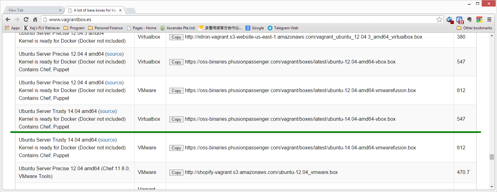
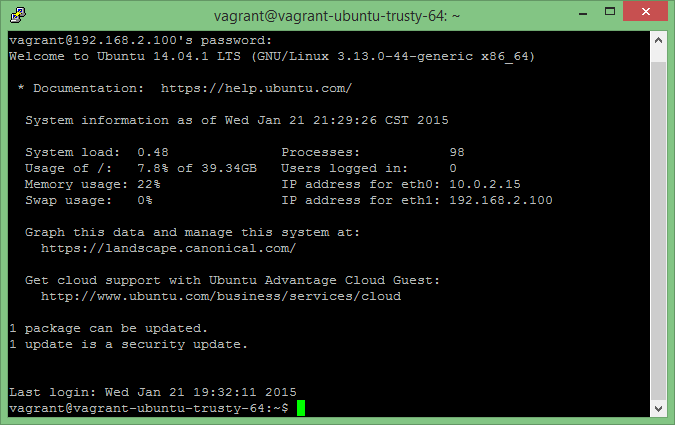

# 1.3 安装Ubuntu 

在Vagrant的术语中，安装一个系统（以及相应的应用）是一个创建一个“盒子”（box）的过程。所以，我们说要安装Ubuntu，实际上就是创建一个Ubuntu的盒子，然后在这个盒子中，再进一步地进行配置和应用的安装。

要创建一个盒子，我们需要一个基础。 针对Vagrant，已经有太多现成的原始“盒子”存在。在本书中，我们用的是“ubuntu/trusty”。

## 1.3.1 下载盒子

我们先建立一个目录，用来存放我们以后要用的经过定制的盒子。比如在`f:\vagrant_env`这个目录。

然后我们访问[http://www.vagrantbox.es/](http://www.vagrantbox.es/)这个站点，寻找我们需要使用的原始盒子：



我们要用的是`Ubuntu Server Trusty 14.04 (Virtual Box)`这个盒子。根据给出的下载链接，我们先将这个“盒子”下载，保存在一个临时目录中（比如说：`f:\temp`下的`\trusty64.box`）。

然后，进入`f:\vagrant_env`目录，建立一个子目录，名字是任意的，但是最好具有指示性，比如：`f:\vagrant_env\remote`，表示这里是一个“远程”的系统。

在`remote`目录中，运行如下命令：

```
vagrant box add "trusty64" "f:\temp\trusty64.box"
```

这将我们刚才下载的那个原始盒子以"`trusty64`"的名字注册在Vagrant的环境中了。

然后运行下面这个命令：

```
vagrant init trusty64
```

开始初始化我们自己的Vagrant/Ubuntu环境。

初始完毕后，当前目录（`f:\vagrant_env\remote`）下会多出一些文件，其中最重要的是`Vagrantfile`文件。它是我们这个定制盒子的配置文件。

## 1.3.2 配置我们的盒子

通过对`Vagrantfile`文件的修改，我们可以配置我们的盒子。

###1.3.2.1 修改我们盒子的IP

我们可以将盒子认为是一个操作系统，一台虚拟的电脑。我们对这个盒子的操作除了某些特定操作之外，必须通过SSH登陆到该系统后方能进行。所以我们需要给这台“电脑”分配一个IP地址。

Vagrant支持三种方式来进行SSH登录：

* **端口转发**。我们可以直接SSH到`localhost:2222`来访问虚拟机的`22`端口，从而登录到虚拟机；
* **私有网络**。我们分配一个与我们Windows机器所在网段不同的网段IP。这也是本书所用的方法。比如，我的Windows机器的IP是`10.0.0.2`，那么给虚拟机分配一个`192.168.2.100`就是一个不错的选择。这将保证，该虚拟机只有Windows本机可以访问，而内网中别的电脑将无法访问。而我们可以通过SSH到`192.168.2.100:22`来完成登录。
* **共有网络**。此时我们分配一个与我们Windows机器所在网段相同的网段的IP。

要将我们的虚拟机设置为私有网络，我们修改`Vagrantfile`中如下的几行：

```
# Create a private network, which allows host-only access to the machine
# using a specific IP.
config.vm.network :private_network, ip: "192.168.2.100"
```

###1.3.2.2 映射Windows目录到虚拟机目录

通常，我习惯在Windows下进行代码的开发。如果我们映射这个工作目录到Vagrant虚拟机中，我们就省去了文件拷贝、同步的麻烦。在任何一端对代码进行修改，在另一端就会立刻反应（因为本来就是同一个文件）。

缺省情况下，Vagrant会映射我们在Windows中启动Vagrant的目录（`f:\vagrant_env\remote`）到Vagrant虚拟机中的`/home/vagrant`目录。这两个目录是等效的。

我们还可以增加更多的Windows目录，将其映射到虚拟机中。

## 1.3.3 启动我们的虚拟机

一切配置完成后，我们就可以启动我们的虚拟机：

```
vagrant up
```

经过一段稍显冗长的过程后，我们的Vagrant虚拟机已经启动。我们可以简单地`ping 192.168.2.100`，来确定该虚拟机已经启动。

## 1.3.4 进入虚拟机系统

我们所启动的虚拟机，已经安装好了我们之前选择的`Ubuntu Server Trusty 14.04`。我们可以使用`putty`或其它第三方程序用SSH的方式安全地登录虚拟机。

缺省情况下，Vagrant盒子的超级用户是`vagrant`，登录密码是`vagrant`。

让我们看看登录后的界面吧：



## 1.3.5 在开始下一步之前

现在是一个很好的时机，对我们这个刚建立好的虚拟机进行一些维护工作。比如，更新一下`apt-get`的源（将其改为使用国内的仓库），对系统进行一次全面的更新，安装一些必要的支持软件等等。

## 1.3.6 停止虚拟机

我们可以用`vagrant halt`来关闭虚拟机。虚拟机关闭后，将不能接受任何指令。

