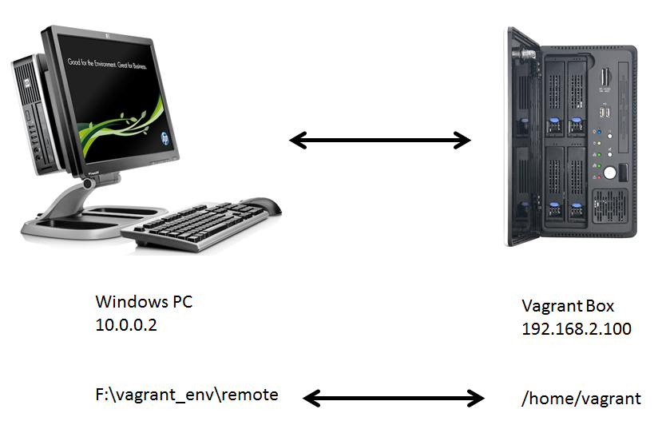

# 1.8 设置一个虚拟主机

让我们再次回顾一下到目前为止我们进行的工作。我们已经有了一个运行正常的LAMP系统运行在一个Vagrant的盒子中。我们可以通过SSH远程登录到这个系统，进行常规的的操作。同时，缺省地，我们有一个Windows下的目录（`f:\vagrant_env\remote`）被映射到了虚拟环境中的`/home/vagrant`中。

我的设想是，我们可以在Windows中利用比较丰富的GUI资源和程序进行PHP和Web应用的编程，对目录和问价年的操作会即时反应到盒子中，然后我们在盒子中来提供这个Web应用的访问。在这种配置下，我们能最大限度地模拟最终的生产环境。用一张图来说明可能更好：



如果我们在Windows机器中用浏览器访问Vagrant盒子：`http://192.168.2.100`，我们已经能够看到由Vagrant盒子伺服的Web内容（现在当然只是Apache缺省的欢迎页面）。

但是我们想做得更完善一点。我想做到的是，在Windows中可以通过`http://vagrant`这样的方式来访问Vagrant中的Web应用，而且这个应用是放在一个我们指定的目录中，便于管理和分发。

##1.8.1 设置Windows的hosts

要能在Windows中用`vagrant`这样的“域名”来访问远程服务器，我们需要修改Windows的系统文件`hosts`，它位于`C:\Windows\System32\drivers\etc`目录下。

**注意：**这是一个系统文件。你需要有Administrator权限才能对这个文件进行修改。

在这个文件中加入这么一行：

```
192.168.2.100	vagrant
```

保存并退出后，在Windows的命令行中输入：`ping vagrant`应该会返回正确的PING信息。

如果我们现在用`http://vagrant`来访问我们的Vagrant盒子，我们还是会得到同样的Apache欢迎页面。这是因为，我们并没有在Vagrant中设置一个“记录”来处理针对`vagrant`的Web访问。

##1.8.2 设置Vagrant的虚拟主机

我建议使用虚拟主机的方式来伺服我们的Web应用。自Apache 2.4以来，Apache对虚拟主机的设置和伺服做了一些改动，因此需要一些相关的指令来设置虚拟主机。

登录Vagrant后，我们进入`/etc/apache2/sites-available`目录，目前这里应该只有一个名为`000-default.conf`的站点配置文件和一个`default-ssl.conf`的文件。

要创建我们自己虚拟主机（站点）配置，我们可以从这个`000-default.conf`出发。先将这个文件做个拷贝：

`cp 000-default.conf 001-vagrant.conf`

然后在终端中用文本编辑其对其进行编辑如下。

```
<VirtualHost *:80>
	ServerName vagrant

	ServerAdmin webmaster@localhost
	DocumentRoot /vagrant
	<Directory "/vagrant">
		Options FollowSymLinks Indexes
		AllowOverride All
		Order allow,deny
		Allow from all
		Require all granted
	</Directory>

	ErrorLog ${APACHE_LOG_DIR}/error.log
	CustomLog ${APACHE_LOG_DIR}/access.log combined

</VirtualHost>
```

说明如下：

1. `ServerName`设置为`vagrant`。这和我们在上一步中对Windows中的`hosts`文件的修改所提供的名字是一样的。
2. `DocumentRoot /vagrant`。为了方便站点文件的同步，我简单地将该站点的根目录设置到了`/vagrant`这个目录。我们应该还记得，这个目录是映射到Windows下的`f:\vagrant_env\remote`目录的。
3. `<Directory "/vagrant">...</Directory>`这一段基本应该按照样本书写。这样才能保证我们能在远程用`http://vagrant`来访问这个站点。

修改完毕后，我们用如下命令使该站点成为可用：

`sudo a2ensite 001-vagrant.conf`

这个命令其实就是在`/etc/apache2/sites-enabled`中做了一个符号链接到`001-vagrant.conf`而已。

最后，我们重启Apache服务。

##1.8.3 访问虚拟主机

一切就绪，让我们来测试一下。

在`f:\vagrant_env\remote`中创建一个`index.php`文件，内容很简单：

```
<?php
phpinfo();
```

保存文件，然后在浏览器中访问这个地址：`http://vagrant`。浏览器应该显示如下内容：


你需要花一点时间来浏览一下这个非常长的页面。需要关注的地方有：

* Apache调用PHP时所使用的`php.ini`。在我的配置中，这个文件是	`/etc/php5/apache2/php.ini`。
* PHP API版本。我的是`20131106`，因为我用的是PHP 5.6.4。
* 相应的PHP扩展（模块）是否已经被启用，如MySQL，MySQL-PDO，GD，mcrypt等等……

##1.8.4 可能出现的错误

如果你不能看到这个页面，那么可能出错的地方有：

* 确定`index.php`文件内容正确，也在正确的位置；
* Apache服务已经启动；
* PHP安装正确；
* Windows下的`hosts`文件有`vagrant`这个域名的解析；
* Apache中虚拟主机的设置正确。

到此，我们的开发环境已经搭建成功。接下来我们要开始使用Symfony来开发我们的应用。 


