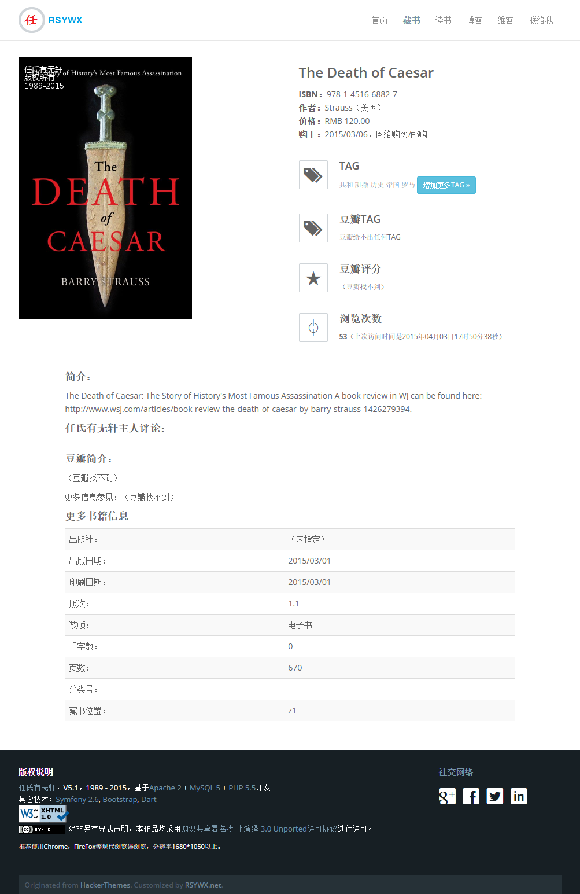

#03.07 模板

SF2缺省使用TWig引擎作为模板的渲染。

一般的应用，都会由不止一个页面构成。

比如我的藏书管理程序包括首页，藏书列表，书评列表和某本书的详情页面，也包括“和我联络”这样的页面。这些页面有些是动态页面，有些是静态页面。但是它们都有类似的布局。我采用的是最常见的“头+主体+尾”的三段式布局。如下两个页面分别是藏书列表和书籍详情页面：




很明显，头部的内容基本保持不变（站点标识，导航条），尾部的内容页基本不变（版权申明等）。变化的是中间主体的内容。如果是藏书列表，就应该是分页显示的书籍列表信息；如果是书籍详情，就显示某本书更详细的信息。

针对这样的布局，在模板设计时我们应该遵循DRY原则，将相似的部分抽取出来成为一个独立的部分并使得这些部分可以在不同的页面中重用。

Twig提供了丰富的功能来完成这些工作。

##`include`一个子模板

在我们刚才讨论的页面布局中，头（`header`）和尾(`footer`）是相对独立和固定的内容，所以可以作为独立的模板存在，并被包含入主模板。

因此，主模板（`layout.html.twig`）的书写大致是这样的：


```
<body>
    <!-- Header Section -->
    
    
    
    
</body>
```


是的，就这么简单。特别请注意`block content`到`endblock`这两行。这两行定义了一个名字为`content`的内容块，但是没有任何内容。这部分内容要由基于该主模板派生的各个模板去填充。

`include`模板还可以传递参数。比如下面的这个例子：

```
{{ include ("AppBundle:default:slider.html.twig", {'random':random}) }} 
```


这个指令在包含`slider.html.twig`模板的时候，也会同时将本模板中`random`这个变量传递到被包含的这个模板中的`random`变量，从而达到变量在两个模板中传递的目的。

（未完待续）


##