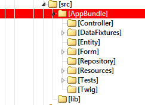

#03.02 Bundle/包

SF对一个应用的结构安排，是基于bundle（包）。这个应用的MVC结构，所有的配套文件都被集中在一个包里。这么做是有好处的。比如，一个应用不再仅仅是一个独立的应用，只要符合一定的规范，这个应用（包）完全可以嵌入到另外一个更大的应用之中。实际上，我们之前看到过的所谓第三方库，都是一个一个独立的bundle，通过composer安装到我们的应用中，成为我们应用中的一部分，并为我们的应用提供功能。

在实际应用中，我们可以将一个包理解为一个目录。一个典型的包可能包括如下的内容：

其中：

* **Controller**中存放所有控制器代码。
* **DataFixtures**中是样本数据填充。
* **Entity**中是所有的数据实体。可以简单地理解为一张张表格。
* **Form**中存放所有的表单类型，用于生成表单。
* **Repository**中是对数据实体的一些自定义操作。
* **Resources/config**中有一部分是以YML形式定义的Doctrine数据实体；另一部分可以存放针对本包的配置文件，如`routing.yml`文件。
* **Resources/views**中会存放所有本包要用到的视图模板，以Twig语法写成。
* **Tests**中可以存放各种测试文件，既可以是单元测试也可是是功能测试。
* **Twig**中存放着专为Twig编写的定制过滤器。

在实际应用中，你的应用可能不会有这么多目录。一个典型的SF2安装，是没有`DataFixtures`, `Form`, `Repository`, `Twig`等目录的。

事实上，有些目录的命名也完全是任意的。上面截屏中的名字只是列出了一个我所开发的应用中的例子。